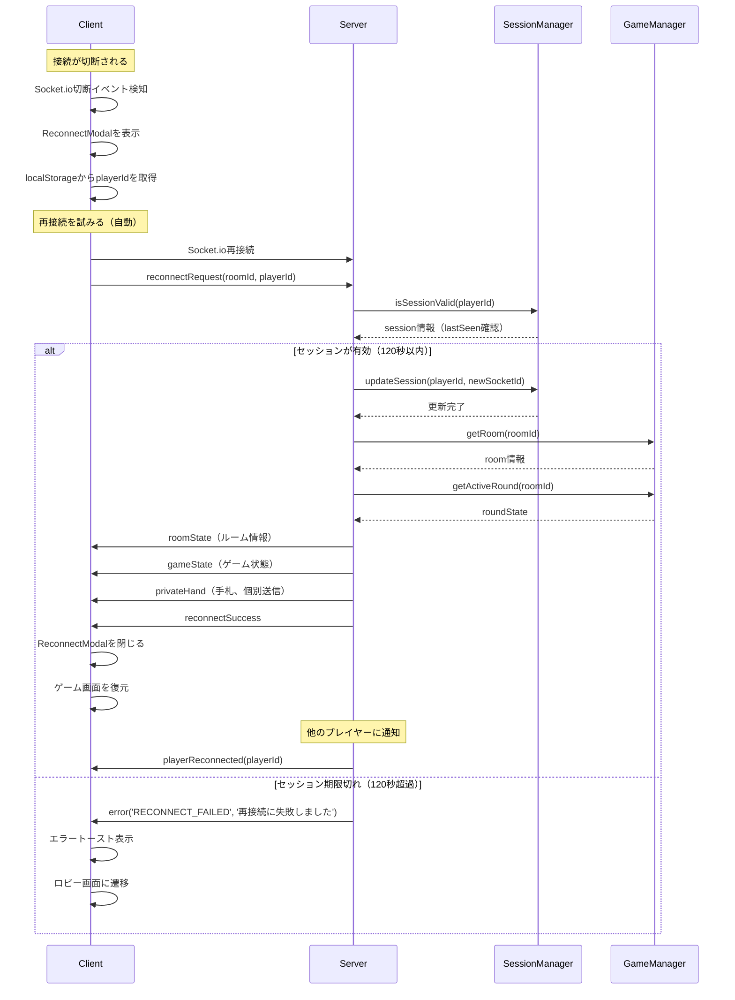
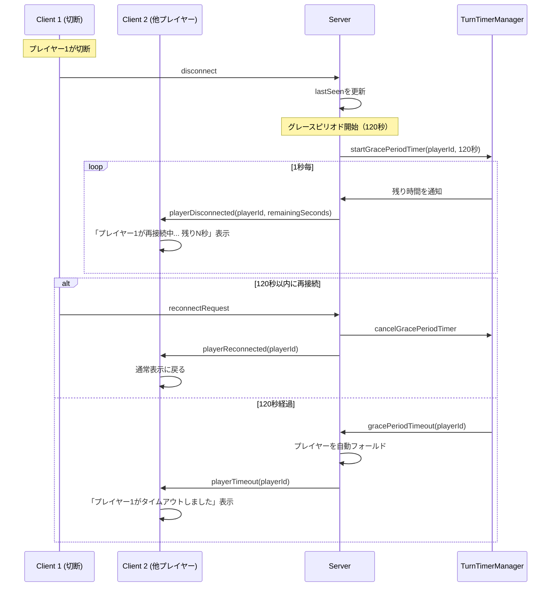
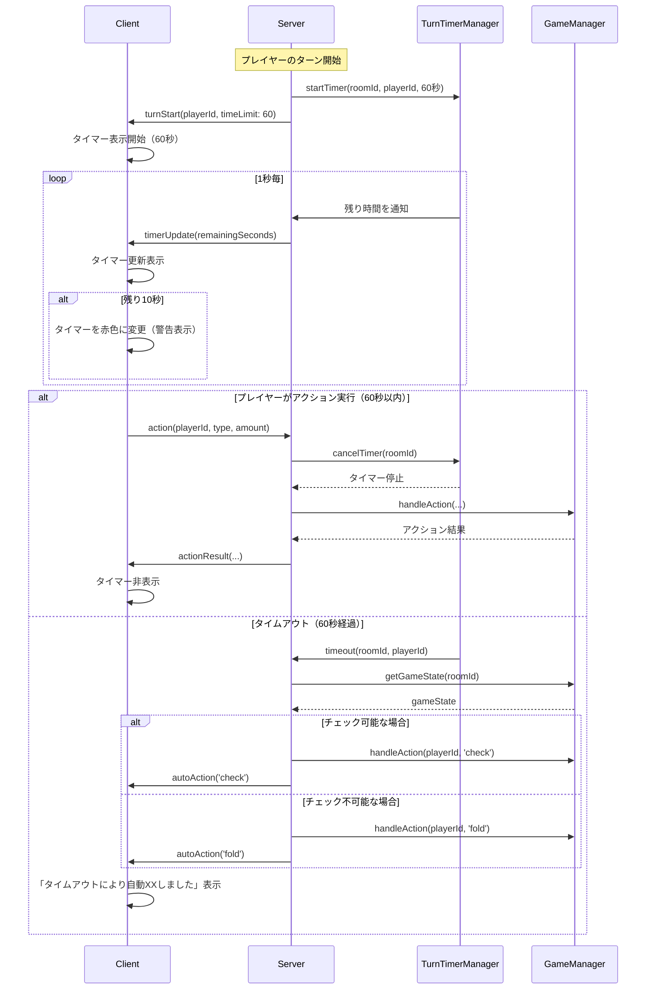
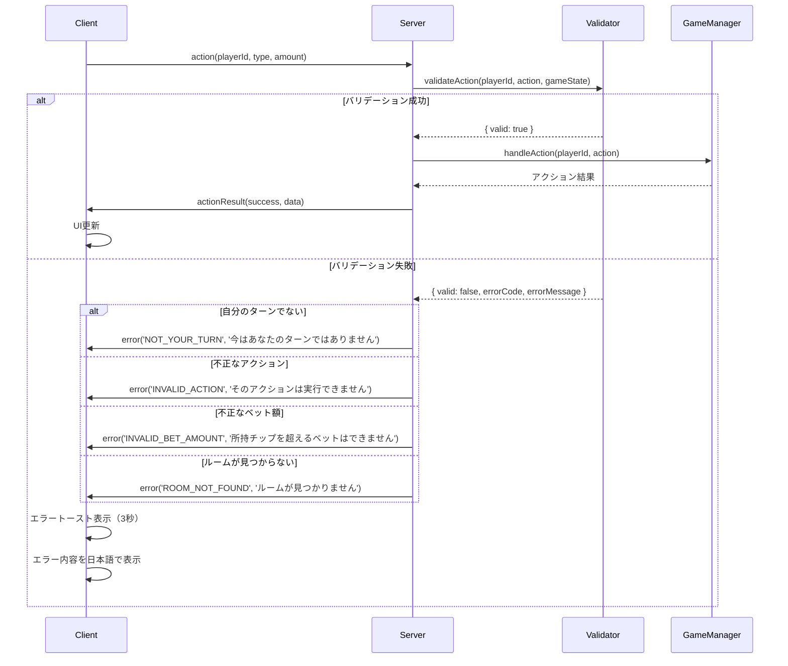
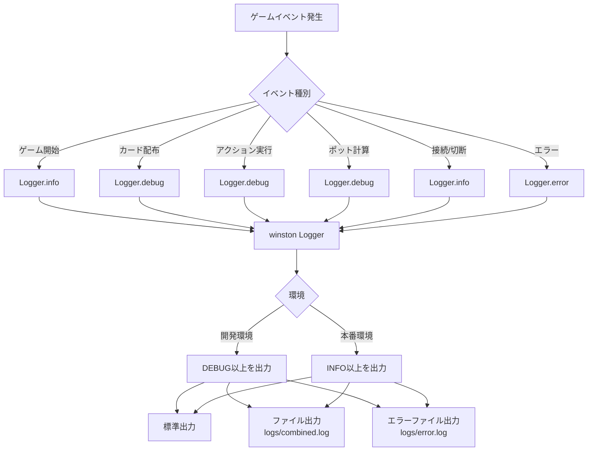
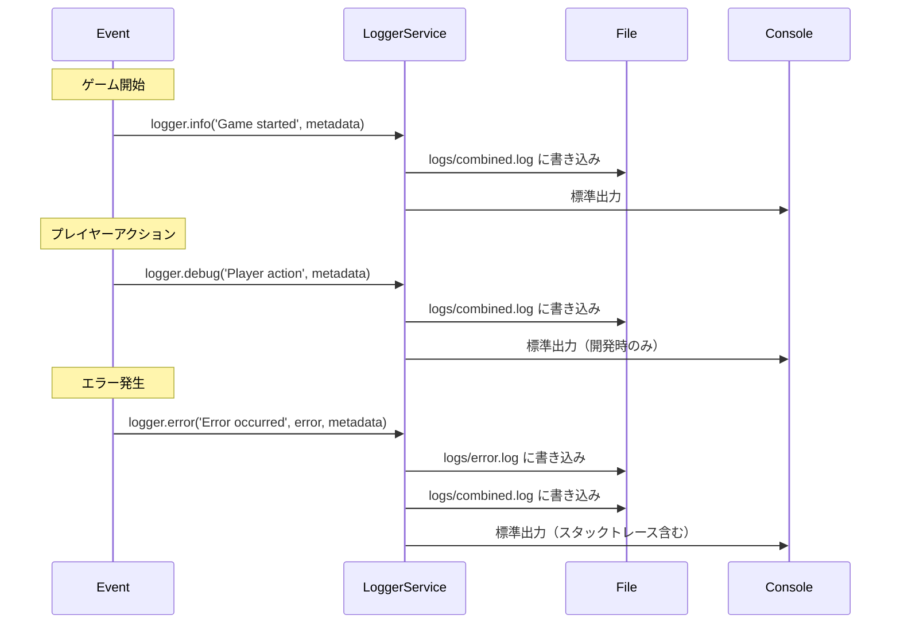
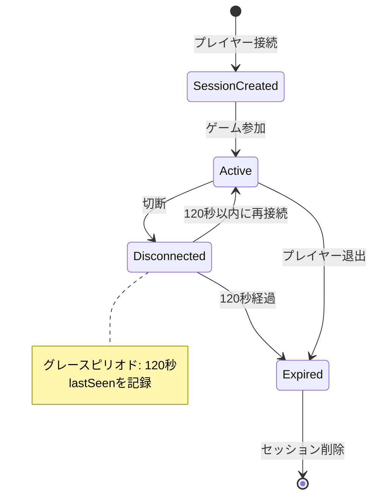
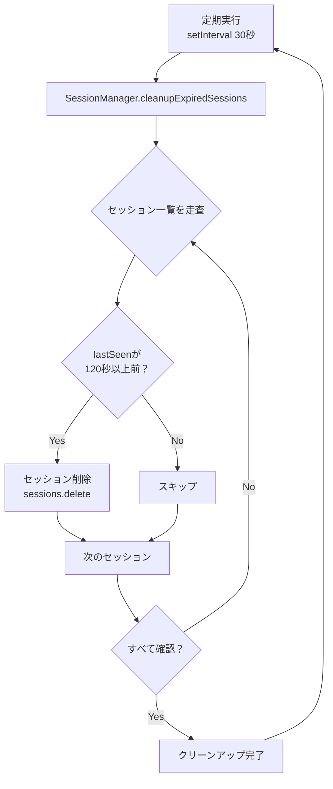
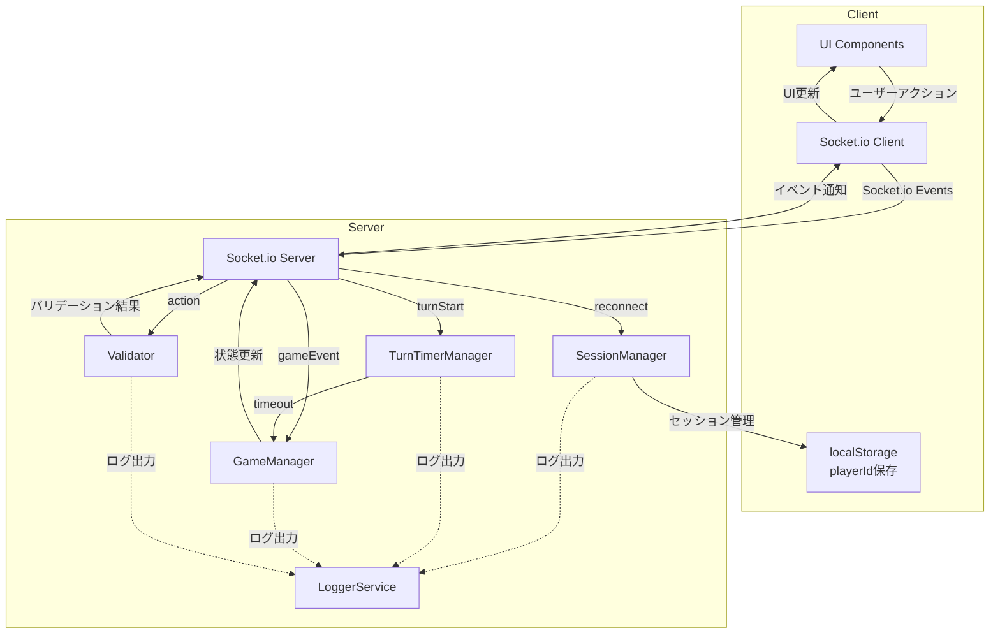
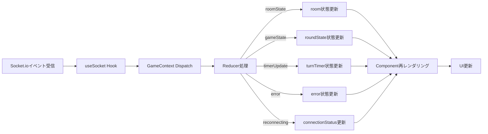

# マイルストーンB データフロー図

## 概要

このドキュメントはマイルストーンBで追加される機能のデータフロー図を示します。

---

## 1. 再接続フロー 🔵 *REQ-005~007, REQ-104~106より*

### シーケンス図

---

## 2. 切断中の他プレイヤーへの通知フロー 🔵 *REQ-106, REQ-202より*

### シーケンス図

---

## 3. ターンタイムアウトフロー 🔵 *REQ-008~010, REQ-107~109より*

### シーケンス図

---

## 4. エラーハンドリングフロー 🔵 *REQ-011~013, REQ-110~113より*

### シーケンス図

---

## 5. ロギングフロー 🔵 *REQ-014~023より*

### データフロー図

### ログ出力タイミング

---

## 6. セッション管理のライフサイクル 🔵 *REQ-001~004より*

### 状態遷移図

### セッションクリーンアップフロー

---

## 7. システム全体のイベントフロー 🔵 *architecture.md設計より*

### 包括的なイベント図

---

## 8. クライアント側状態管理フロー 🟡 *React Context設計の妥当な推測*

### 状態更新フロー

---

## 変更履歴

| 日付 | バージョン | 変更内容 |
|------|-----------|---------|
| 2025-11-22 | 1.0 | 初版作成（マイルストーンBデータフロー図） |
