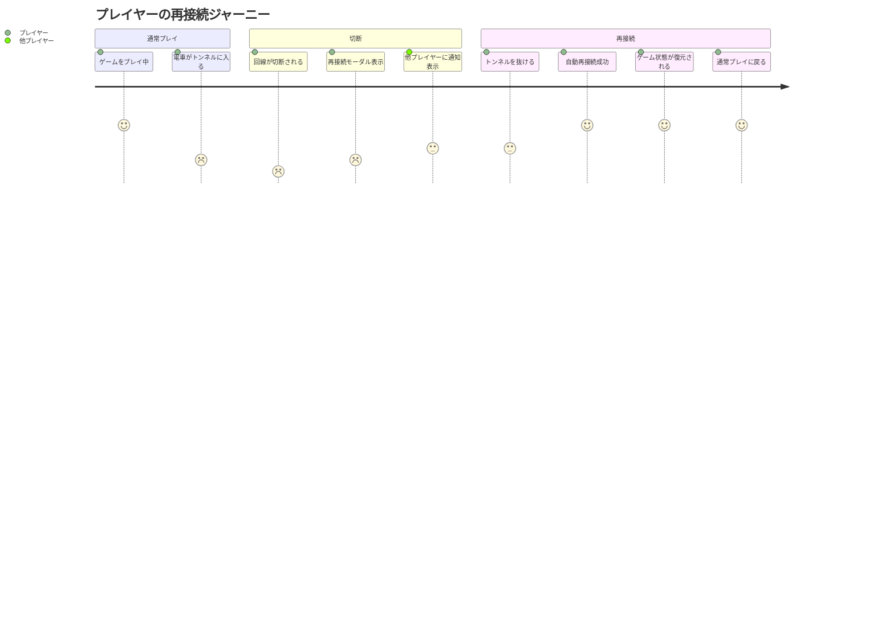
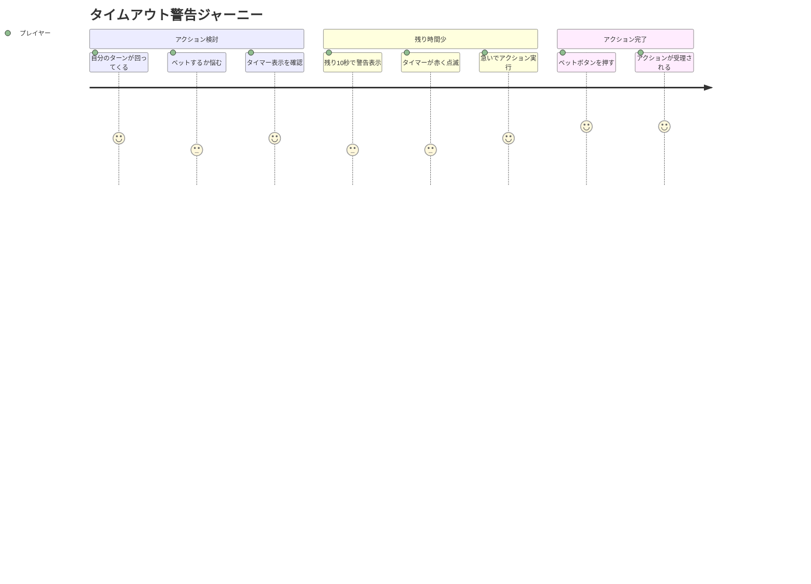

# マイルストーンB（安定化） ユーザーストーリー

## 概要

このドキュメントはマイルストーンB（安定化）機能の詳細なユーザーストーリーを記載します。

## ユーザー種別の定義

### プライマリユーザー

- **プレイヤー**: ポーカーゲームをプレイするエンドユーザー。主にモバイルブラウザ（iPhone Safari）またはデスクトップブラウザを使用。
- **ホストプレイヤー**: ルームを作成し、ゲームを開始する権限を持つプレイヤー。

### セカンダリユーザー

- **開発者**: ログを確認してバグ修正・機能改善を行う。
- **システム**: タイムアウト処理や自動アクションを実行する自動化エージェント。

---

## ユーザストーリー

**【信頼性レベル凡例】**:
- 🔵 **青信号**: EARS要件定義書・設計文書・ユーザーヒアリングを参考にした確実なストーリー
- 🟡 **黄信号**: EARS要件定義書・設計文書・ユーザーヒアリングから妥当な推測によるストーリー
- 🔴 **赤信号**: EARS要件定義書・設計文書・ユーザーヒアリングにない推測によるストーリー

---

## 📚 エピック1: 再接続機能 🔵 *implementation-plan.md「再接続機能実装」より*

### ストーリー1.1: モバイル回線の切断からの復帰 🔵 *ユーザーヒアリング2025-11-22「120秒グレースピリオド」より*

**ユーザストーリー**:
- **私は** プレイヤー **として**
- **電車移動中にトンネルでモバイル回線が切断された場合に**
- **トンネルを抜けた後に自動的にゲームに復帰したい**
- **そうすることで** ゲームを最初からやり直すことなく、中断した場所から継続できる

**詳細説明**:
- **背景**: モバイル環境では一時的な通信断が頻繁に発生する。友達とのゲーム中に切断されると、再度ルームに入り直す手間が発生し、ゲーム体験が悪化する。
- **前提条件**: プレイヤーがゲーム進行中に通信が切断される
- **利用シーン**:
  - 電車のトンネル通過時
  - Wi-Fiと4G回線の切り替え時
  - 一時的な電波状況の悪化
- **期待する体験**:
  - 切断後、120秒以内に回線が復旧すれば自動的にゲームに復帰
  - 復帰時に現在のゲーム状態（手札、ポット、ターン等）が正しく表示される
  - 他のプレイヤーには「プレイヤーXが再接続を試みています... 残りN秒」と表示される

**関連要件**: REQ-005, REQ-006, REQ-007, REQ-104, REQ-106

**優先度**: 高

**見積もり**: 5ストーリーポイント

---

### ストーリー1.2: 長時間切断時の自動フォールド 🔵 *implementation-plan.md + ユーザーヒアリング2025-11-22より*

**ユーザストーリー**:
- **私は** プレイヤー **として**
- **120秒以上切断が続いてゲームに復帰できなかった場合に**
- **自動的にフォールド扱いになり、他のプレイヤーがゲームを続行できるようにしたい**
- **そうすることで** 一人が離脱してもゲームが止まらず、他のプレイヤーが待たされることがない

**詳細説明**:
- **背景**: 長時間切断された場合、他のプレイヤーを無期限に待たせることは不公平。
- **前提条件**: プレイヤーが120秒を超えて切断状態
- **利用シーン**:
  - バッテリー切れでスマホが落ちた
  - 急な用事で離席した
  - ネットワーク障害が長引いた
- **期待する体験**:
  - 120秒経過時点で自動的にフォールド
  - 他のプレイヤーには「プレイヤーXがタイムアウトによりフォールドしました」と通知
  - ゲームはそのまま継続

**関連要件**: REQ-105, EDGE-003

**優先度**: 高

**見積もり**: 3ストーリーポイント

---

### ストーリー1.3: 再接続中のステータス表示 🔵 *ユーザーヒアリング2025-11-22「タイマー表示あり」より*

**ユーザストーリー**:
- **私は** 待機中のプレイヤー **として**
- **他のプレイヤーが切断された場合に**
- **再接続を試みているかどうかと残り時間を視覚的に確認したい**
- **そうすることで** どのくらい待てば良いのか分かり、安心してゲームを続けられる

**詳細説明**:
- **背景**: 切断されたプレイヤーが戻ってくるのか分からないと、他のプレイヤーが不安になる。
- **前提条件**: 他のプレイヤーが切断中
- **利用シーン**:
  - 友達が切断された時
  - 複数人が同時に切断された時
- **期待する体験**:
  - 切断されたプレイヤーの座席に「再接続中... 残り95秒」とカウントダウン表示
  - タイマーが視覚的に分かりやすい（プログレスバーやアニメーション）
  - 複数人が切断された場合、それぞれ独立したタイマー表示

**関連要件**: REQ-106, REQ-202

**優先度**: 中

**見積もり**: 3ストーリーポイント

---

## 📚 エピック2: タイムアウト処理 🔵 *implementation-plan.md「タイムアウト実装」より*

### ストーリー2.1: 考え中のタイムリミット 🔵 *ユーザーヒアリング2025-11-22「60秒タイムアウト」より*

**ユーザストーリー**:
- **私は** プレイヤー **として**
- **自分のターンで考え込んでいる時に**
- **60秒のタイムリミットがあることで、ゲームのテンポを保ちたい**
- **そうすることで** 一人が長考しすぎて他のプレイヤーが待たされることがなくなる

**詳細説明**:
- **背景**: ポーカーは戦略的なゲームだが、友達との遊びでは適度なテンポが重要。
- **前提条件**: 自分のターンが回ってきた
- **利用シーン**:
  - ベットするかフォールドするか迷っている
  - レイズ額を考えている
  - スマホを置いて離席してしまった
- **期待する体験**:
  - ターン開始時に60秒タイマーが表示される
  - カウントダウンが分かりやすく表示される
  - 60秒経過すると自動的にアクション（check/fold）が実行される

**関連要件**: REQ-008, REQ-009, REQ-107

**優先度**: 高

**見積もり**: 4ストーリーポイント

---

### ストーリー2.2: タイムアウト警告 🔵 *ユーザーヒアリング2025-11-22「警告あり、残り10秒」より*

**ユーザストーリー**:
- **私は** プレイヤー **として**
- **考え込んでいて残り時間が少なくなった時に**
- **視覚的な警告を受け取りたい**
- **そうすることで** うっかりタイムアウトしてしまうことを防げる

**詳細説明**:
- **背景**: 集中していると時間の経過に気づかないことがある。
- **前提条件**: ターンタイマーが残り10秒以下
- **利用シーン**:
  - 手札と相手のベット額を見比べて悩んでいる
  - チャット（今後実装予定）を見ていて時間を忘れていた
- **期待する体験**:
  - 残り10秒でタイマー表示が赤色に変わる
  - 点滅やアニメーションで注意を引く
  - 音声警告（オプション、将来検討）

**関連要件**: REQ-010, REQ-204, REQ-028

**優先度**: 中

**見積もり**: 2ストーリーポイント

---

### ストーリー2.3: 自動アクションの挙動理解 🔵 *architecture.md「タイムアウト処理」より*

**ユーザストーリー**:
- **私は** プレイヤー **として**
- **タイムアウト時に自動的にどのアクションが実行されるか知りたい**
- **そうすることで** 予期しないフォールドを避けられる

**詳細説明**:
- **背景**: タイムアウトの挙動が分からないと、不公平感や混乱が生じる。
- **前提条件**: タイムアウトが発生しそうな状況
- **利用シーン**:
  - 初めてプレイする時
  - ルール説明を読んでいる時
- **期待する体験**:
  - チェック可能な場合は自動チェック
  - チェック不可能な場合は自動フォールド
  - どちらのアクションが実行されたか明確に通知される

**関連要件**: REQ-108, REQ-109

**優先度**: 中

**見積もり**: 2ストーリーポイント

---

## 📚 エピック3: エラーハンドリング 🔵 *implementation-plan.md「エラーハンドリング」より*

### ストーリー3.1: 不正操作の防止と通知 🔵 *architecture.md「サーバサイド検証」より*

**ユーザストーリー**:
- **私は** プレイヤー **として**
- **誤って不正な操作をしてしまった時に**
- **分かりやすいエラーメッセージで理由を教えてほしい**
- **そうすることで** 何が間違っていたのか理解し、正しい操作を行える

**詳細説明**:
- **背景**: 初めてプレイする人は操作ミスをしやすい。
- **前提条件**: 不正な操作を試みた
- **利用シーン**:
  - 自分のターンでない時にボタンを押してしまった
  - 許可されていないアクション（例: チェックできない時にチェック）を選んだ
  - 所持チップ以上のベットをしようとした
- **期待する体験**:
  - 「今はあなたのターンではありません」等の分かりやすいメッセージ
  - エラー理由が明確
  - トースト通知で一時的に表示され、自動で消える

**関連要件**: REQ-011, REQ-012, REQ-013, REQ-029, REQ-030

**優先度**: 高

**見積もり**: 3ストーリーポイント

---

### ストーリー3.2: ルームが見つからない時の案内 🔵 *socketHandler.ts 実装 + UX設計より*

**ユーザストーリー**:
- **私は** プレイヤー **として**
- **間違ったルームIDを入力した時に**
- **ルームが見つからないことを明確に通知してほしい**
- **そうすることで** 正しいルームIDを再入力できる

**詳細説明**:
- **背景**: ルームID入力ミスは頻繁に起こる。
- **前提条件**: 存在しないルームIDを入力
- **利用シーン**:
  - 友達から口頭で聞いたルームIDを間違えた
  - タイプミスした
  - 既に終了したルームに参加しようとした
- **期待する体験**:
  - 「ルームが見つかりません。ルームIDを確認してください」と表示
  - 入力フォームにフォーカスが戻る
  - 再入力しやすいUI

**関連要件**: REQ-113

**優先度**: 中

**見積もり**: 2ストーリーポイント

---

## 📚 エピック4: ロギングと監査 🔵 *implementation-plan.md「ロギング強化」 + ユーザーヒアリング2025-11-22「デバッグ含む」より*

### ストーリー4.1: 開発者によるバグ調査 🔵 *ユーザーヒアリング2025-11-22「詳細ログ」より*

**ユーザストーリー**:
- **私は** 開発者 **として**
- **ユーザーからバグ報告を受けた時に**
- **詳細なログからゲームの流れを再現したい**
- **そうすることで** バグの原因を特定し、修正できる

**詳細説明**:
- **背景**: ゲームロジックのバグは再現が難しい場合がある。
- **前提条件**: バグ報告を受けた
- **利用シーン**:
  - 「ポット計算がおかしい」という報告
  - 「ゲームが進まなくなった」という報告
  - 「チップが減りすぎた」という報告
- **期待する体験**:
  - ゲーム開始からのすべてのアクションがログに記録されている
  - カード配布、ベット額、ポット計算の詳細が分かる
  - タイムスタンプで時系列が把握できる
  - デバッグレベルのログで内部状態が確認できる

**関連要件**: REQ-014, REQ-015, REQ-016, REQ-117, REQ-119, REQ-120, REQ-121, REQ-122

**優先度**: 高

**見積もり**: 4ストーリーポイント

---

### ストーリー4.2: 監査証跡の確保 🔵 *implementation-plan.md「デッキシャッフル監査」より*

**ユーザストーリー**:
- **私は** 開発者 **として**
- **ゲームの公平性を証明する必要がある時に**
- **デッキのシャッフル状態やカード配布履歴を確認したい**
- **そうすることで** イカサマがないことを証明できる

**詳細説明**:
- **背景**: オンラインゲームでは公平性の証明が重要。
- **前提条件**: ゲームが実行された
- **利用シーン**:
  - ユーザーから「同じカードばかり来る」と指摘された
  - 配布の公平性を検証したい
- **期待する体験**:
  - デッキのシャッフル時にハッシュ値がログに記録される
  - カード配布のタイミングと内容がログに記録される
  - 後から検証可能な形式で保存される

**関連要件**: REQ-120

**優先度**: 中

**見積もり**: 3ストーリーポイント

---

## ユーザージャーニー

### ジャーニー1: モバイル回線切断からの復帰 🔵 *ユーザーヒアリング2025-11-22より*

**詳細**:
1. **ゲームをプレイ中**: 友達とポーカーを楽しんでいる（満足度: 高）
2. **電車がトンネルに入る**: 突然回線が切れる（満足度: 低）
3. **回線が切断される**: 画面に「接続が切れました」と表示（満足度: 非常に低）
4. **再接続モーダル表示**: 「再接続を試みています...」と表示（満足度: 低）
5. **他プレイヤーに通知表示**: 「プレイヤーXが再接続中... 残り110秒」（満足度: 中）
6. **トンネルを抜ける**: 回線が復旧（満足度: 中）
7. **自動再接続成功**: 自動的にゲームに復帰（満足度: 高）
8. **ゲーム状態が復元される**: 手札やポットが正しく表示（満足度: 高）
9. **通常プレイに戻る**: 何事もなかったかのようにプレイ継続（満足度: 高）

---

### ジャーニー2: タイムアウト防止 🔵 *ユーザーヒアリング2025-11-22より*

**詳細**:
1. **自分のターンが回ってくる**: 60秒タイマー開始（満足度: 中）
2. **ベットするか悩む**: 手札と相手の動きを分析（満足度: 中）
3. **タイマー表示を確認**: 残り20秒と気づく（満足度: 中）
4. **残り10秒で警告表示**: タイマーが赤色に変わる（満足度: 中）
5. **タイマーが赤く点滅**: 注意を引かれる（満足度: 中）
6. **急いでアクション実行**: ベットを決断（満足度: 中）
7. **ベットボタンを押す**: ギリギリで間に合う（満足度: 高）
8. **アクションが受理される**: タイムアウトを回避（満足度: 高）

---

## ペルソナ定義

### ペルソナ1: モバイルゲーマー太郎 🔵 *ユーザーヒアリング・要件定義より*

- **基本情報**: 25歳、会社員、週3回の通勤電車でスマホゲーム
- **ゴール**: 友達と気軽にポーカーを楽しみたい、移動中でも快適にプレイしたい
- **課題**:
  - トンネルや地下鉄で頻繁に回線が切れる
  - 切断されるとゲームが最初からやり直しになるのが嫌
  - スマホの小さい画面でも操作しやすいUIが必要
- **行動パターン**:
  - 平日夜や休日に友達とオンラインで集まる
  - 1ゲーム15-30分程度を想定
  - 片手操作が多い
- **利用環境**: iPhone Safari、モバイル回線（時々Wi-Fi）

---

### ペルソナ2: 初心者プレイヤー花子 🟡 *UX要件からの妥当な推測*

- **基本情報**: 22歳、大学生、ポーカー初心者
- **ゴール**: ルールを覚えながら友達と楽しく遊びたい
- **課題**:
  - ルールがまだよく分からない
  - 操作ミスをしやすい
  - エラーメッセージが難しいと分からない
- **行動パターン**:
  - ゆっくり考えてアクションする
  - 時々操作を間違える
  - 友達に教えてもらいながらプレイ
- **利用環境**: デスクトップChrome、自宅Wi-Fi

---

## 非機能的ユーザー要求

### ユーザビリティ要求

- **学習容易性**: 初回利用時でも再接続の仕組みが直感的に理解できる
- **効率性**: タイムアウト警告により、時間を有効に使える
- **記憶しやすさ**: 一度理解すれば、再接続やタイムアウトの挙動を忘れない
- **エラー対応**: エラーメッセージが分かりやすく、対応しやすい
- **満足度**: 切断されても安心してプレイできる、ストレスフリーな体験

### アクセシビリティ要求

- **視覚**: タイマーや警告表示が色覚多様性に配慮されている
- **聴覚**: 音声警告はオプション（将来検討）
- **運動**: タッチ操作が片手でも快適
- **認知**: エラーメッセージが平易な日本語で表示される

---

## 変更履歴

| 日付 | バージョン | 変更内容 |
|------|-----------|---------|
| 2025-11-22 | 1.0 | 初版作成 |
